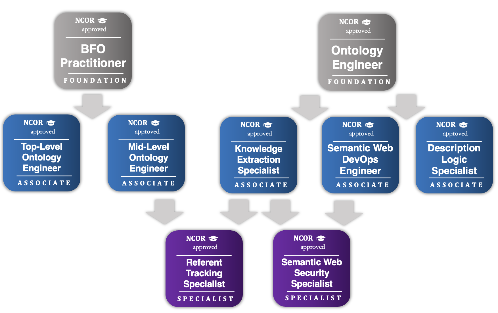

<!DOCTYPE html>
<html lang="en">
<head>
    <meta charset="UTF-8">
    <title>NCOR Certificate Pathways</title>
    
</head>
<body>
    <header>
        
        <h1>NCOR Certificate Pathways</h1>
    </header>
    <main>
        <section id="intro">
            <h2>Foundational Certificates</h2>
            
Explore ontology engineering concepts, technologies, and the semantic web stack that can facilitate their development.

        </section>
        <section id="courses">
            

                <article class="card">
                    <h3>BFO: Basic Formal Ontology Practitioner</h3>
                    
Learn the basics of BFO classes and relations, applications, and design patterns.

                </article>
                <article class="card">
                    <h3>ONE: Ontology Engineer</h3>
                    
Deep-dive into ontology engineering technologies.

                </article>
            

        </section>
        <section id="intro2">
            <h2>Associate Certificates</h2>
            
Explore ontology engineering concepts, technologies, and the semantic web stack that can facilitate their development.

        </section>
        <section id="courses2">
            

                <article class="card">
                    <h3>KES: Knowledge Extraction Specialist (Prerequisite: ONE)</h3>
                    
Deep-dive into ontology engineering technologies.

                </article>
                <article class="card">
                    <h3>SWD: Semantic Web DevOps Engineer (Prerequisite: ONE)</h3>
                    
Deep-dive into ontology engineering technologies.

                </article>
                <article class="card">
                    <h3>TLO: Top-Level Ontology Engineer (Prerequisite: BFO)</h3>
                    
Deep-dive into ontology engineering technologies.

                </article>
                <article class="card">
                    <h3>MLO: Mid-Level Ontology Engineer (Prerequisite: BFO)</h3>
                    
Deep-dive into ontology engineering technologies.

                </article>
            

        </section>
        <section id="intro3">
            <h2>Specialist Certificates</h2>
            
Master specialized ontology engineering topics, such as cyber security and referent-tracking.

        </section>
        <section id="courses3">
            

                <article class="card">
                    <h3>SWS: Semantic Web Security Specialist (Prerequisites: KES, SWD)</h3>
                    
Deep-dive into ontology engineering technologies.

                </article>
                <article class="card">
                    <h3>RTE: Referent Tracking Specialist (Prerequisites: KES, MLO)</h3>
                    
Deep-dive into ontology engineering technologies.

                </article>
                <article class="card">
                    <h3>DLS: Description Logic Specialist (Prerequisites: KES, SWD)</h3>
                    
Deep-dive into ontology engineering technologies.

                </article>
            

        </section>
        <section id="open-source">
            <h2>Open-Source Courses</h2>
            
Explore our collection of open-source training materials to enhance your skills.

            

                

                    <h3><a href="http://ncorwiki.buffalo.edu/index.php/Applied_Ontology,_Spring_2022">Applied Ontology</a></h3>
                    
Dive into applied ontology with open-source tools.

                

                

                    <h3><a href="/index.php/Intelligence_Analysis:_A_Crash_Course">Intelligence Analysis: A Crash Course</a></h3>
                    
Learn how to deploy intelligence analytics effectively using open-source software.

                

                

                    <h3><a href="http://ncorwiki.buffalo.edu/index.php/Biomedical_Ontology_2016">Biomedical Ontology</a>/h3>
                    
Dive into biomedical ontology development with open-source tools.

                

            

            <button class="prev">Previous</button>
            <button class="next">Next</button>
        </section>
    </main>
    
    
</body>
</html>
